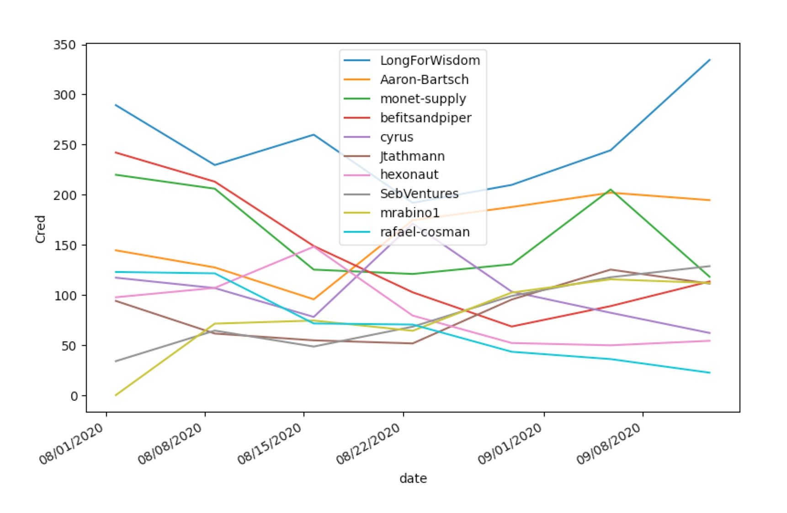

# sourcecred-analysis

This repo contains python scripts for analyzing [SourceCred](https://github.com/sourcecred/sourcecred) data. 

Below are instructions for running two scripts in the repo:

- `discourse_analysis.py`: a script for analyzing Discourse data, including ranking of posts and users by Cred score.
- `analyze_cred_graph.py`: a script for analyzing Discourse data in graph form, including analyzing Cred flows to and from a given node in the Cred graph [WARNING: uses out-of-date version of SourceCred]. 

# `discourse_analysis.py`

This script parses `credResult.json`, a file automatically generated when you run a SourceCred instance. Currently it only parses Discourse data. A sample file from the [MakerDAO forum](https://forum.makerdao.com/) is provided for illustration.

## Running

To analyze the sample data, just run `discourse_analysis.py`. The script will output tables of the top 10 posts by Cred earned, the top 10 contributors by Cred earned, and a plot of the top users over time, as shown below. 

|   Cred | Contribution                                                                                                                                  | Author   |
|--------|-----------------------------------------------------------------------------------------------------------------------------------------------|----------|
|  194.9 | [#1 on [Signal Request] Should we take Emergency action to fix the peg?](https://forum.makerdao.com/t/4096/1)                                 | user     |
|  138.5 | [#1 on MIP7c3-SP3: Domain Team Onboarding (Risk Domain Team)](https://forum.makerdao.com/t/4050/1)                                            | user     |
|  124.3 | [#1 on Working Group: Autonomous MakerDAO](https://forum.makerdao.com/t/4036/1)                                                               | user     |
|  115.6 | [#1 on [Signal Request] Should Real World Asset collateral onboarding be prioritised in the short term?](https://forum.makerdao.com/t/4075/1) | user     |
|  112.9 | [#1 on [Signal Request] Should we increase USDC-A debt ceiling?](https://forum.makerdao.com/t/4068/1)                                         | user     |
|  105.9 | [#1 on MIP23: Domain Structure and Roles](https://forum.makerdao.com/t/4021/1)                                                                | user     |
|   93.9 | [#2 on [Signal Request] Should we increase USDC-A debt ceiling?](https://forum.makerdao.com/t/4068/2)                                         | user     |
|   91.3 | [#1 on Optimal Bidding Strategy for Maker Auctions [research paper]](https://forum.makerdao.com/t/4033/1)                                     | user     |
|   87.9 | [#35 on [Signal Request] Should we take Emergency action to fix the peg?](https://forum.makerdao.com/t/4096/35)                               | user     |
|   87.4 | [#8 on Expedited Executive Vote: 2020-09-14](https://forum.makerdao.com/t/4125/8)                                                             | user     |

|   Cred | Contributor    |
|--------|----------------|
|  310.6 | LongForWisdom  |
|  228.2 | Primoz         |
|  175.7 | Aaron-Bartsch  |
|  115.3 | SebVentures    |
|  101.8 | monet-supply   |
|  101.6 | befitsandpiper |
|  100.1 | mrabino1       |
|   97.4 | NikKunkel      |
|   96.7 | Jtathmann      |
|   82.5 | Planet-X       |



# `analyze_cred_graph.py`


NOTE: this script relies on a now outdated output data format. A sample JSON file (created from the MakerDAO forums) is provided below that will work, but if you want to analyze newly generated output, you'll need to update the script yourself, or try generating a JSON filt to analyze by 
running SourceCred [v0.6.0](https://github.com/sourcecred/sourcecred/releases/tag/v0.6.0) and using the `output` command.


## Installation

`git clone https://github.com/s-ben/sourcecred-analysis.git`

`cd sourcecred-analysis`

`pip install requirements.txt `


## Running

The `analyze_cred_graph.py` script exposes a CLI tool that looks up a node (contribution) in the SourceCred contribution graph and provides some high-level info on cred flowing into that node from adjacent nodes. Namely a brief description of each adjacent node flowing cred to it, cred inflow per node, and the edge type.

Contributions are queried from the command line by providing a URL to a contribution and its node type:

```python analyze_cred_graph.py -i PATH_TO_OUTPUT_JSON -u CONTRIBUTION_URL -t NODE_TYPE```


The following node types are supported:

- discourse/topic
- discourse/user
- discourse/post
 

Below is an example query that uses a the following sample output from the MakerDAO forums:


```python analyze_cred_graph.py -i Maker_output2.json -u https://forum.makerdao.com/t/collateral-onboarding-process-v1/1412 -t discourse/topic```

The `Maker_output2.json` file in the example above can be downloaded [here](https://drive.google.com/file/d/1t9MMUI4n25ZkOevK8WVRytHMdIW6I66-/view?usp=sharing). Just drop this file into the same directory as `python analyze_cred_graph.py` before running.

Sample output:

```
Top Cred sources 


Cred: 10.49830341341081
Edge type :discourse/references topic
Node description :[post #1 on Governance Initiative: Collateral On-Boarding Process](https://forum.makerdao.com/t/1344/1)


Cred: 5.953417489677223
Edge type :discourse/references topic
Node description :[post #1 on The Maker Foundation’s Vision of a Self-sustaining MakerDAO: Initiation of Maker Improvement Proposals (MIPs) Framework](https://forum.makerdao.com/t/1882/1)


Cred: 2.9212462292812593
Edge type :discourse/references topic
Node description :[post #1 on The Release of the 13 Initial Maker Improvement Proposals (MIPs)](https://forum.makerdao.com/t/1915/1)


Cred: 2.1259242476126654
Edge type :discourse/references topic
Node description :[post #3 on [Agenda/Discussion] Scientific Governance and Risk - Thursday, April 2 9AM PST (4:00 PM UTC)](https://forum.makerdao.com/t/1867/3)


Cred: 1.8784509259001447
Edge type :discourse/references topic
Node description :[post #13 on It's time for a second Governance Facilitator](https://forum.makerdao.com/t/1998/13)


Cred: 1.465782495622546
Edge type :discourse/contains post
Node description :[post #1 on Collateral Onboarding Process (v1)](https://forum.makerdao.com/t/1412/1)


Cred: 1.237233483533974
Edge type :discourse/contains post
Node description :[post #4 on Collateral Onboarding Process (v1)](https://forum.makerdao.com/t/1412/4)


Cred: 0.6791611735327769
Edge type :discourse/contains post
Node description :[post #5 on Collateral Onboarding Process (v1)](https://forum.makerdao.com/t/1412/5)


Cred: 0.5709967847807634
Edge type :discourse/contains post
Node description :[post #2 on Collateral Onboarding Process (v1)](https://forum.makerdao.com/t/1412/2)


Cred: 0.3950765011919031
Edge type :discourse/references topic
Node description :[post #126 on Black Thursday Response Thread](https://forum.makerdao.com/t/1433/126)


Cred: 0.3376828271364834
Edge type :discourse/contains post
Node description :[post #3 on Collateral Onboarding Process (v1)](https://forum.makerdao.com/t/1412/3)


Cred: 0.323679770858315
Edge type :discourse/contains post
Node description :[post #11 on Collateral Onboarding Process (v1)](https://forum.makerdao.com/t/1412/11)


Cred: 0.21943298178960827
Edge type :discourse/contains post
Node description :[post #6 on Collateral Onboarding Process (v1)](https://forum.makerdao.com/t/1412/6)


Cred: 0.2155281704157845
Edge type :discourse/contains post
Node description :[post #8 on Collateral Onboarding Process (v1)](https://forum.makerdao.com/t/1412/8)


Cred: 0.17632454349007515
Edge type :discourse/contains post
Node description :[post #7 on Collateral Onboarding Process (v1)](https://forum.makerdao.com/t/1412/7)


Cred: 0.1612889956579445
Edge type :discourse/contains post
Node description :[post #9 on Collateral Onboarding Process (v1)](https://forum.makerdao.com/t/1412/9)


Cred: 0.06091200031186385
Edge type :discourse/contains post
Node description :[post #10 on Collateral Onboarding Process (v1)](https://forum.makerdao.com/t/1412/10)


Ss-MacBook-Pro:sourcecred-analysis sben$ 
Ss-MacBook-Pro:sourcecred-analysis sben$ python analyze_cred_graph.py -i Maker_output2.json -u https://forum.makerdao.com/t/collateral-onboarding-process-v1/1412 -t discourse/topic
Top Cred sources 


Cred: 10.49830341341081
Edge type :discourse/references topic
Node description :[post #1 on Governance Initiative: Collateral On-Boarding Process](https://forum.makerdao.com/t/1344/1)


Cred: 5.953417489677223
Edge type :discourse/references topic
Node description :[post #1 on The Maker Foundation’s Vision of a Self-sustaining MakerDAO: Initiation of Maker Improvement Proposals (MIPs) Framework](https://forum.makerdao.com/t/1882/1)


Cred: 2.9212462292812593
Edge type :discourse/references topic
Node description :[post #1 on The Release of the 13 Initial Maker Improvement Proposals (MIPs)](https://forum.makerdao.com/t/1915/1)


Cred: 2.1259242476126654
Edge type :discourse/references topic
Node description :[post #3 on [Agenda/Discussion] Scientific Governance and Risk - Thursday, April 2 9AM PST (4:00 PM UTC)](https://forum.makerdao.com/t/1867/3)


Cred: 1.8784509259001447
Edge type :discourse/references topic
Node description :[post #13 on It's time for a second Governance Facilitator](https://forum.makerdao.com/t/1998/13)


Cred: 1.465782495622546
Edge type :discourse/contains post
Node description :[post #1 on Collateral Onboarding Process (v1)](https://forum.makerdao.com/t/1412/1)


Cred: 1.237233483533974
Edge type :discourse/contains post
Node description :[post #4 on Collateral Onboarding Process (v1)](https://forum.makerdao.com/t/1412/4)


Cred: 0.6791611735327769
Edge type :discourse/contains post
Node description :[post #5 on Collateral Onboarding Process (v1)](https://forum.makerdao.com/t/1412/5)


Cred: 0.5709967847807634
Edge type :discourse/contains post
Node description :[post #2 on Collateral Onboarding Process (v1)](https://forum.makerdao.com/t/1412/2)


Cred: 0.3950765011919031
Edge type :discourse/references topic
Node description :[post #126 on Black Thursday Response Thread](https://forum.makerdao.com/t/1433/126)


Cred: 0.3376828271364834
Edge type :discourse/contains post
Node description :[post #3 on Collateral Onboarding Process (v1)](https://forum.makerdao.com/t/1412/3)


Cred: 0.323679770858315
Edge type :discourse/contains post
Node description :[post #11 on Collateral Onboarding Process (v1)](https://forum.makerdao.com/t/1412/11)


Cred: 0.21943298178960827
Edge type :discourse/contains post
Node description :[post #6 on Collateral Onboarding Process (v1)](https://forum.makerdao.com/t/1412/6)


Cred: 0.2155281704157845
Edge type :discourse/contains post
Node description :[post #8 on Collateral Onboarding Process (v1)](https://forum.makerdao.com/t/1412/8)


Cred: 0.17632454349007515
Edge type :discourse/contains post
Node description :[post #7 on Collateral Onboarding Process (v1)](https://forum.makerdao.com/t/1412/7)


Cred: 0.1612889956579445
Edge type :discourse/contains post
Node description :[post #9 on Collateral Onboarding Process (v1)](https://forum.makerdao.com/t/1412/9)


Cred: 0.06091200031186385
Edge type :discourse/contains post
Node description :[post #10 on Collateral Onboarding Process (v1)](https://forum.makerdao.com/t/1412/10)
```


